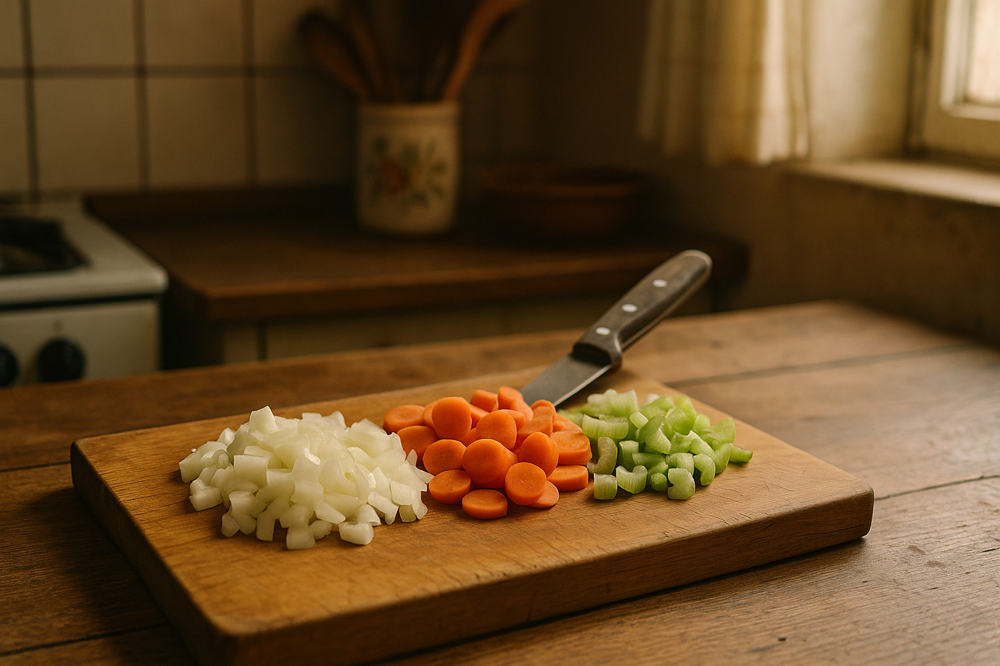
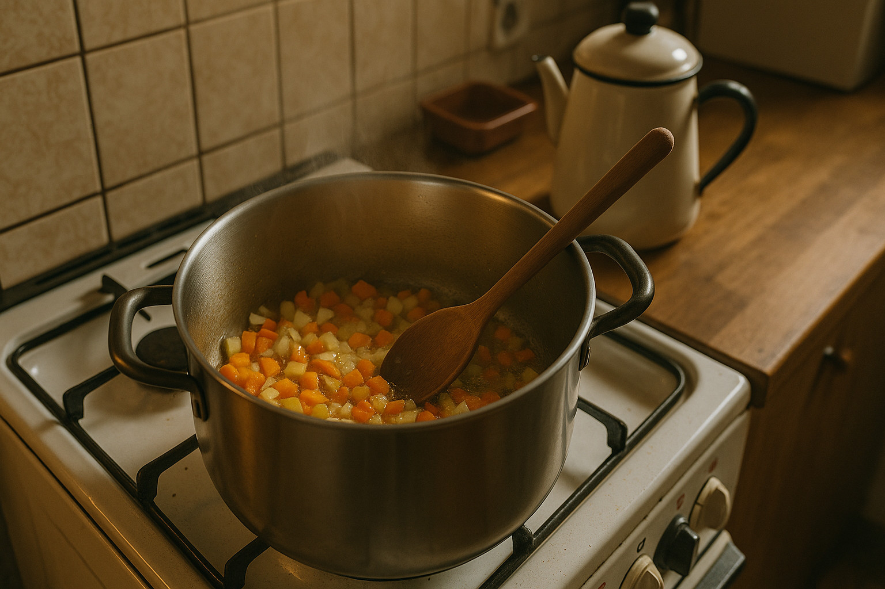
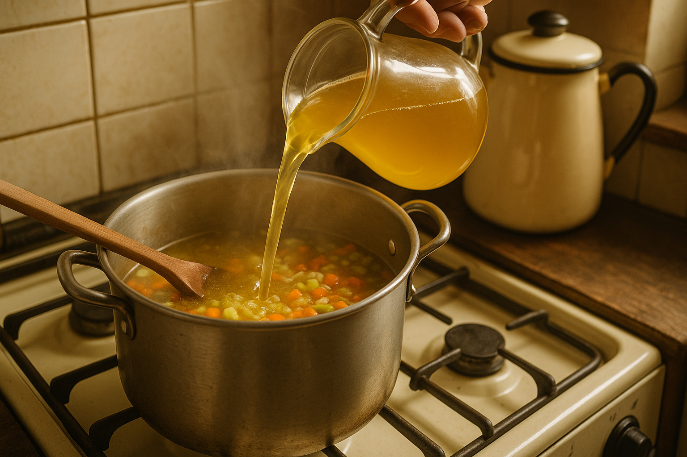
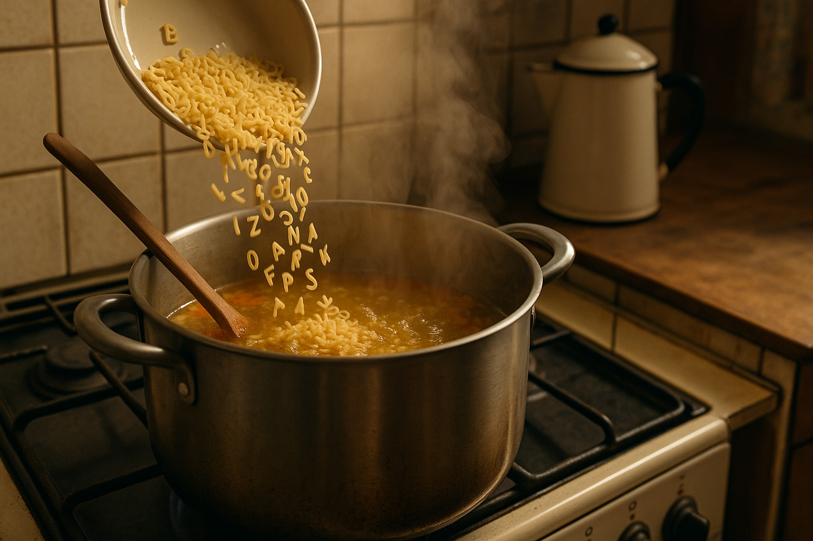
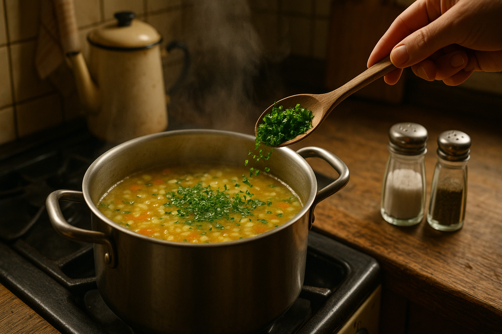
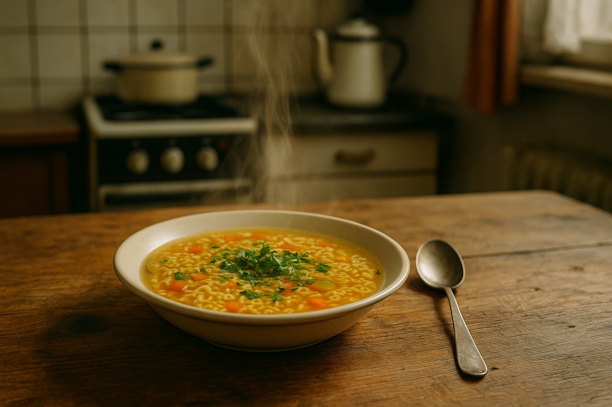
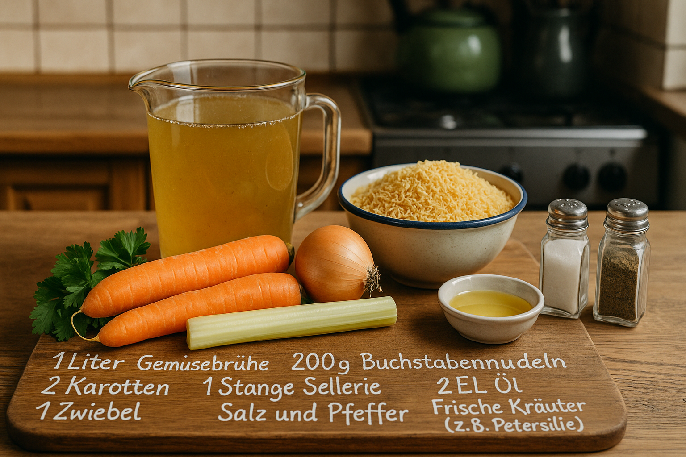

<!--
author:   Your Name

email:    your@mail.org

version:  0.0.1

language: de

narrator: Deutsch Female

import: https://raw.githubusercontent.com/LiaTemplates/Communica/0.0.2/README.md

-->

# Kochbuch Buchstabensuppe

## Zutaten


| Zutat                             | Menge                    |
| --------------------------------- | ------------------------ |
| Gemüsebrühe                       | 1000 g (1 Liter)         |
| Buchstabennudeln                  | 200 g                    |
| Karotten                          | 200 g (ca. 2 Stück)      |
| Sellerie (Stange)                 | 100 g (1 Stange)         |
| Zwiebel                           | 80 g (1 Stück)           |
| Öl                                | 20 g (2 EL)              |
| Salz und Pfeffer                  | nach Geschmack           |
| Frische Kräuter (z.B. Petersilie) | 10 g (nach Belieben)     |

## Zubereitung

    --{{0}}--
!?[](media/Kochschau.mp4#t=0,10)

    --{{1}}--
Die Zwiebel, Karotten und Sellerie klein schneiden.
!?[](media/Kochschau.mp4#t=10.5,14.5)

      {{1}}


    --{{2}}--
Das Öl in einem großen Topf erhitzen und das Gemüse darin anbraten.
!?[](media/Kochschau.mp4#t=15,20)

      {{2}}


    --{{3}}--
Die Gemüsebrühe hinzufügen und zum Kochen bringen.
!?[](media/Kochschau.mp4#t=20,24)

      {{3}}


    --{{4}}--
Die Buchstabennudeln hinzufügen und nach Packungsanweisung garen.
!?[](media/Kochschau.mp4#t=24.5,29)

      {{4}}


    --{{5}}--
Mit Salz, Pfeffer und frischen Kräutern abschmecken.
!?[](media/Kochschau.mp4#t=30,33.5)

     {{5}}


    --{{6}}--
Heiß servieren und genießen!
!?[](media/Kochschau.mp4#t=33.5)

      {{6}}


## Medien

?[eat it](https://open.spotify.com/intl-de/track/0WuYuWhLws8VahMy2zLLRJ)

!?[Buchstabensuppe](https://www.youtube.com/watch?v=V6paiDYJmOo)

## Buchstabensuppenwissen

<marquee style="color: blue; font-size: 15rem;">
Teste dein Wissen!
</marquee>


<!-- style="width: 100%;" -->

### 1. Texteingabe

Wie viele Gramm Karotten werden für das Rezept benötigt?

[[200]]

### 2. Auswahl

Welche Zutat ist NICHT in der Buchstabensuppe enthalten?

[->[ Sellerie 🥬 | Zwiebel 🧅 | (Tomate 🍅) | Buchstabennudeln 🍝 ]]

---

### 3. Single Choice

Wie viel Gemüsebrühe wird für das Rezept verwendet?

- [( )] 500 ml
- [( )] 750 ml
- [(x)] 1000 ml
- [( )] 1500 ml

---

### 4. Multiple Choice

Welche der folgenden Zutaten werden laut Rezept benötigt? (Mehrere Antworten möglich)

- [[x]] Karotten
- [[x]] Öl
- [[ ]] Reis
- [[x]] Frische Kräuter
**************************

> __Es kommen nur die folgenden Zutaten in die Suppe:__
>
> 

**************************

### 5. Lückentext

Fülle die Lücken aus:


    {{|> French Male}}
Für die Buchstabensuppe benötigst du [[  200  ]] Gramm Karotten, [[  80   ]] Gramm Zwiebel und [->[ (Sellerie 🥬) | Tomate 🍅 | Paprika 🫑 ]] als Gemüse. Die Nudeln heißen [->[ (Buchstabennudeln 🍝) | Spaghetti 🍝 | Reis 🍚 ]]. Insgesamt werden [[ 1000  ]] ml Gemüsebrühe verwendet.


## Wenn mehr Gäste kommen

``` javascript
const Zutaten = {
  "Gemüsebrühe": 1000.0,
  "Buchstabennudeln": 200.0,
  "Karotten": 200.0,
  "Sellerie (Stange)": 100.0,
  "Zwiebel": 80.0,
  "Öl": 20.0,
  "Salz und Pfeffer": null,
  "Frische Kräuter (z.B. Petersilie)": 10.0
}

const Personen = 1;

const ZutatenProPerson = {};

for (const [zutat, menge] of Object.entries(Zutaten)) {
  ZutatenProPerson[zutat] = (menge / 4) * Personen;
}

console.log(JSON.stringify(ZutatenProPerson, null, 2));
```
<script>@input</script>


### Zutatenformular
<!--
@menge
<script default="1000">
const Personen = @input(`personen`);
const Menge = @0 / 4;

Menge * Personen * Math.random();
</script>
@end
-->

Personen: <script input="range" value="1" min="1" default="1" output="personen">@input</script>


| Zutat                             | Menge in Gramm |
| --------------------------------- | -------------: |
| Gemüsebrühe                       | @menge(1000) g |
| Buchstabennudeln                  |  @menge(200) g |
| Karotten                          |  @menge(200) g |
| Sellerie (Stange)                 |  @menge(100) g |
| Zwiebel                           |   @menge(80) g |
| Öl                                |   @menge(20) g |
| Salz und Pfeffer                  | nach Geschmack |
| Frische Kräuter (z.B. Petersilie) |   @menge(10) g |


### Weitere Macros

#### Wie wird das Wetter?

longitude: <script default="13.33125" input="range" output="longitude">@input</script>

latitude: <script default="50.92558" input="range" output="latitude">@input</script>

<script run-once="true" style="display: block">
  fetch("https://api.open-meteo.com/v1/forecast?latitude=@input(`latitude`)&longitude=@input(`longitude`)&hourly=temperature_2m")
    .then(response => response.json())
    .then(data => {
      let table = "<!-- data-show data-type='line' data-title='Open-Meteo Weather API' -->\n"

      table += "| Time | Temperature |\n"
      table += "| ---- | ----------- |\n"

      for (let i=0; i < data.hourly.time.length; i++) {
        table += "| " + data.hourly.time[i] + " | " + data.hourly.temperature_2m[i] + " |\n"
      }
      send.lia("LIASCRIPT: "+table) }
    )
    .catch(e => {
      send.lia("ups, something went wrong")
    })
  "waiting for the weather"
</script>


#### Sparql?

```sparql
# source: https://dbpedia.org/sparql

SELECT ?property ?value WHERE {
  <http://dbpedia.org/resource/Alphabet_soup> ?property ?value
} LIMIT 20
```
@Communica.SPARQL


## Klassenräume

...