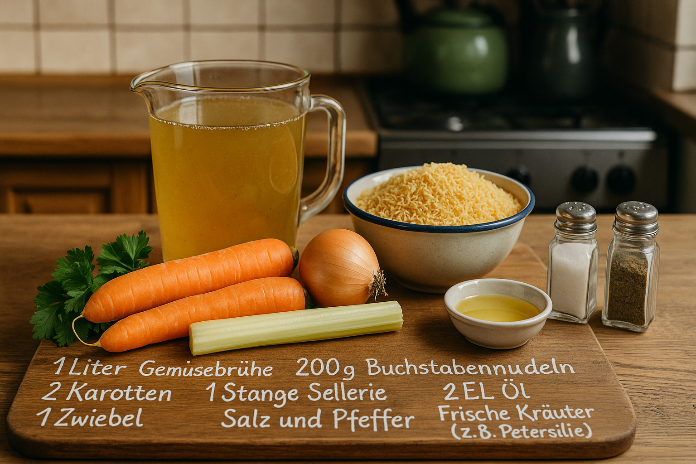
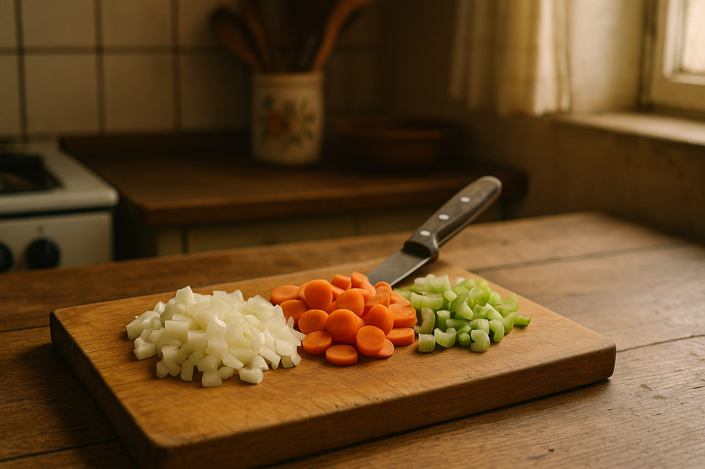
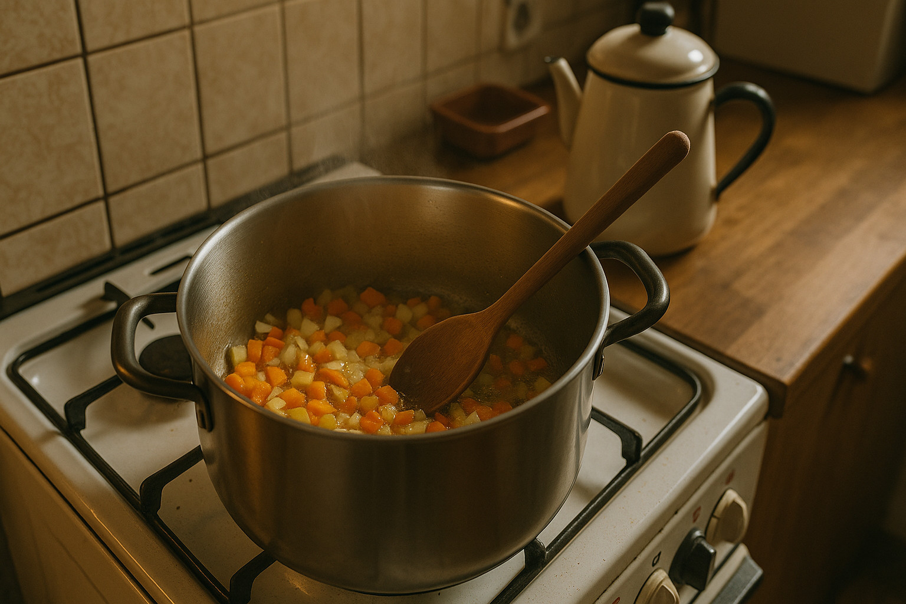
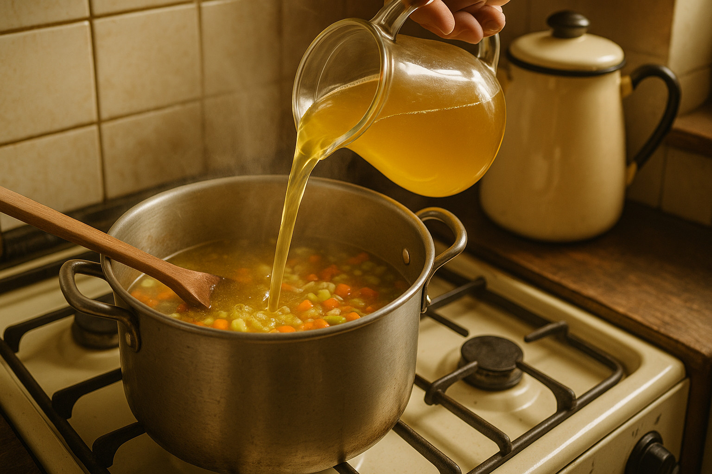
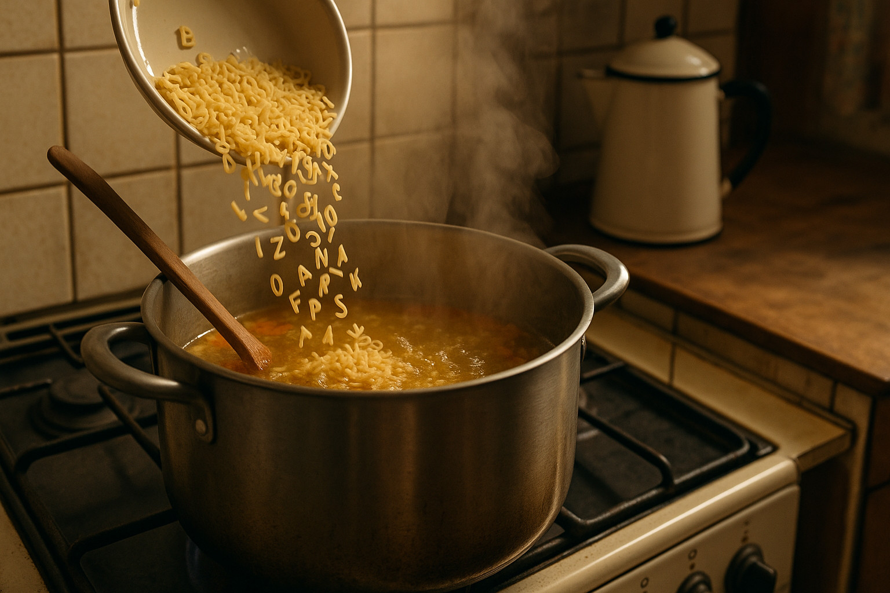
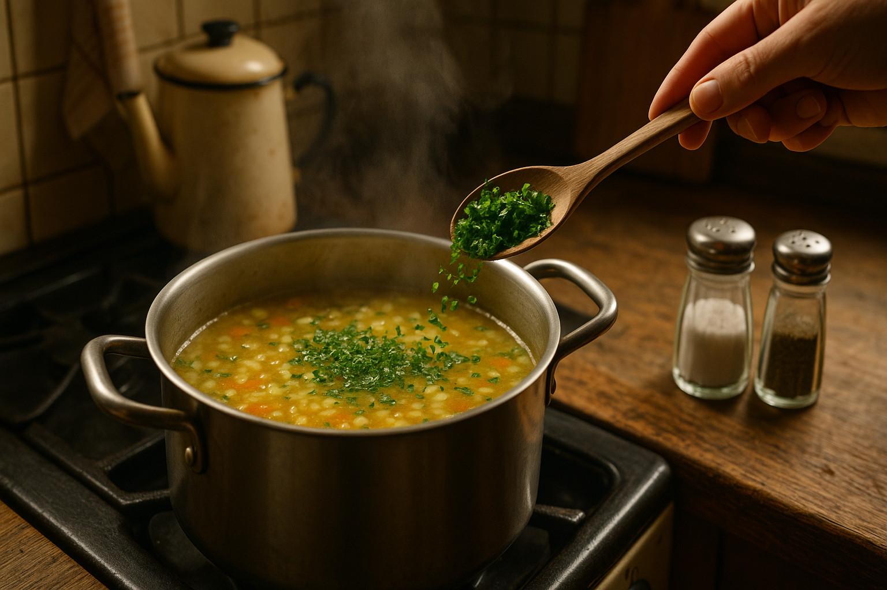
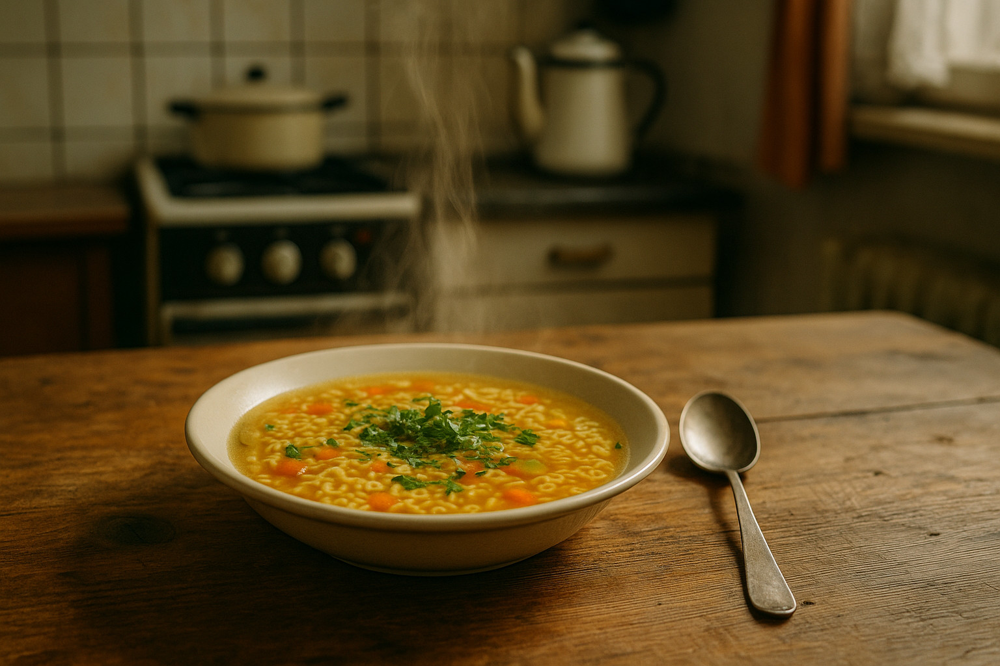

<!--
author:   Your Name

email:    your@mail.org

version:  0.0.1

edit:     true

language: de

narrator: Deutsch Female

-->

# Kochbuch Buchstabensuppe

## Zutaten



| Zutat                             | Menge               |
| --------------------------------- | ------------------- |
| Gemüsebrühe                       | 1000g (1 Liter)     |
| Buchstabennudeln                  | 200g                |
| Karotten                          | 200g (ca. 2 Stück)  |
| Sellerie (Stange)                 | 100g (1 Stange)     |
| Zwiebel                           | 80g (1 Stück)       |
| Öl                                | 20g (2 EL)          |
| Salz und Pfeffer                  | nach Geschmack      |
| Frische Kräuter (z.B. Petersilie) | 10g (nach Belieben) |

## Zubereitung

1. Die Zwiebel, Karotten und Sellerie klein schneiden.



2. Das Öl in einem großen Topf erhitzen und das Gemüse darin anbraten.



3. Die Gemüsebrühe hinzufügen und zum Kochen bringen.



4. Die Buchstabennudeln hinzufügen und nach Packungsanweisung garen.



5. Mit Salz, Pfeffer und frischen Kräutern abschmecken.



6. Heiß servieren und genießen!



## Medien

[eat it](https://open.spotify.com/intl-de/track/0WuYuWhLws8VahMy2zLLRJ)

[Kochschau](media/Kochschau.mp4#t=0,10)

[Buchstabensuppe](https://www.youtube.com/watch?v=V6paiDYJmOo)

[Küche by Sketchfab](https://sketchfab.com/3d-models/kitchen-model-619862462bb9471282314af19669690f "by _MetaArt Design Studio_")


## Buchstabensuppenwissen

Teste dein Wissen!


### 1. Texteingabe

Wie viele Gramm Karotten werden für das Rezept benötigt?

200

### 2. Auswahl

Welche Zutat ist NICHT in der Buchstabensuppe enthalten?

Sellerie 🥬 | Zwiebel 🧅 | ~~Tomate 🍅~~ | Buchstabennudeln 🍝

### 3. Single Choice

Wie viel Gemüsebrühe wird für das Rezept verwendet?

- 500 ml
- 750 ml
- 1000 ml
- 1500 ml

---

### 4. Multiple Choice

Welche der folgenden Zutaten werden laut Rezept benötigt? (Mehrere Antworten möglich)

- Karotten
- Öl
- Reis
- Frische Kräuter


> __Es kommen nur die folgenden Zutaten in die Suppe:__
>
> 


### 5. Lückentext

Fülle die Lücken aus:

Für die Buchstabensuppe benötigst du ( 200 ) Gramm Karotten, ( 80 ) Gramm Zwiebel und Sellerie 🥬 | Tomate 🍅 | Paprika 🫑 als Gemüse. Die Nudeln heißen Buchstabennudeln 🍝 | Spaghetti 🍝 | Reis 🍚. Insgesamt werden ( 1000 ) ml Gemüsebrühe verwendet.


## Wenn mehr Gäste kommen

``` javascript
const Zutaten = {
  "Gemüsebrühe": 1000.0,
  "Buchstabennudeln": 200.0,
  "Karotten": 200.0,
  "Sellerie (Stange)": 100.0,
  "Zwiebel": 80.0,
  "Öl": 20.0,
  "Salz und Pfeffer": null,
  "Frische Kräuter (z.B. Petersilie)": 10.0
}

const Personen = 1;

const ZutatenProPerson = {};

for (const [zutat, menge] of Object.entries(Zutaten)) {
  ZutatenProPerson[zutat] = (menge / 4) * Personen;
}

console.log(JSON.stringify(ZutatenProPerson, null, 2));
```


### Zutatenformular
<!--

@mengen
<script default="@0">
const Personen = @input(`personen`);
const Menge = @0 / 4;

Menge * Personen * Math.random();
</script>
@end

-->

Personen:
<script input="range" value="1" min="1" default="1" output="personen">
@input
</script>


| Zutat                             | Menge in Gramm |
| --------------------------------- | -------------: |
| Gemüsebrühe                       |  menge(1000) g |
| Buchstabennudeln                  |   menge(200) g |
| Karotten                          |   menge(200) g |
| Sellerie (Stange)                 |   menge(100) g |
| Zwiebel                           |    menge(80) g |
| Öl                                |    menge(20) g |
| Salz und Pfeffer                  | nach Geschmack |
| Frische Kräuter (z.B. Petersilie) |    menge(10) g |


### Weitere Macros

https://github.com/topics/liascript-template

#### Wie wird das Wetter?

``` html
longitude: <script default="13.33125" input="range" output="longitude">@input</script>

latitude: <script default="50.92558" input="range" output="latitude">@input</script>

<script run-once="true" style="display: block">
  fetch("https://api.open-meteo.com/v1/forecast?latitude=@input(`latitude`)&longitude=@input(`longitude`)&hourly=temperature_2m")
    .then(response => response.json())
    .then(data => {
      let table = "<!-- data-show data-type='line' data-title='Open-Meteo Weather API' -->\n"

      table += "| Time | Temperature |\n"
      table += "| ---- | ----------- |\n"

      for (let i=0; i < data.hourly.time.length; i++) {
        table += "| " + data.hourly.time[i] + " | " + data.hourly.temperature_2m[i] + " |\n"
      }
      send.lia("LIASCRIPT: "+table) }
    )
    .catch(e => {
      send.lia("ups, something went wrong")
    })
  "waiting for the weather"
</script>
```

#### Sparql?

`import: https://raw.githubusercontent.com/LiaTemplates/Communica/0.0.2/README.md`

```sparql
# source: https://dbpedia.org/sparql

SELECT ?property ?value WHERE {
  <http://dbpedia.org/resource/Alphabet_soup> ?property ?value
} LIMIT 20
```
@Communica.SPARQL


## Klassenräume

...